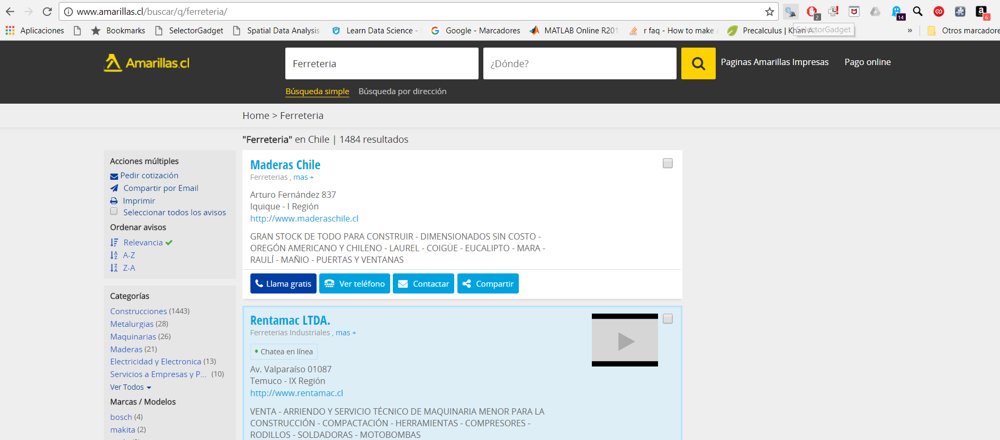
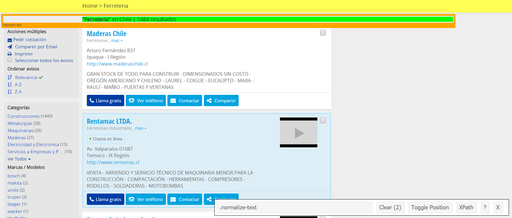
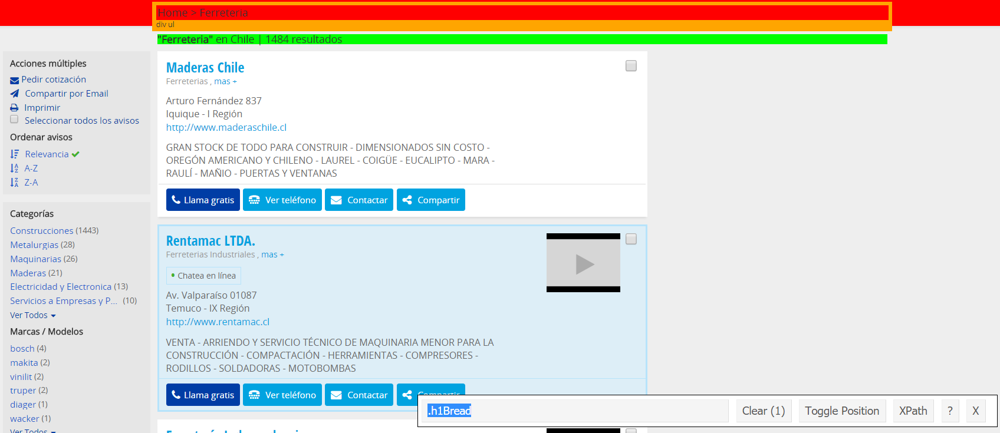

```{r setup, include=FALSE}
knitr::opts_chunk$set(echo = TRUE)
```

Acá muestro como contruí un Web Scraper que nos permite extraer los resutlados de una consulta hecha en **Las Páginas Amarillas**. Obviamente, las funciones aquí creadas sirven para la estructura actual del buscador de Páginas Amarillas, no obstante, se explicará la lógica detrás de cada una de ellas, para que, en caso que sea necesario modificarlas, la tarea sea más fácil.

Ahora bien, si no es necesario saber como funciona el Web Scraper y sólo se esta interesado en usarlo, basta con correr el script `web_scraper_paginas_amarillas.R` y utilizar la función `scrape_write_table()` para obtener una base de datos de la consulta hecha:

```{r message = FALSE, warning = FALSE}
# Cargar librerías ==============
library(rvest)
library(stringr)
library(tidyverse)
library(DT)

# Cargar funciones Web Scraper
# guardar en el working directory y luego cargarlo
# con source()
source("web_scraper_paginas_amarillas.R")

# Hacer una consulta, se crea base de datos en working directory
scrape_write_table('carniceria')

# cargar y abrir base de datos de consulta
df_carniceria <- read_tsv('carniceria.tsv')

# datatable es sólo para mostrar el data frame en este archivo html, no 
# necesario para hacer la consulta
datatable(df_carniceria, rownames = FALSE)

```

El Web Scraper se creó en base al tutorial [Web Scraping in R: rvest Tutorial](https://www.datacamp.com/community/tutorials/r-web-scraping-rvest).

El objetivo del Web Scraper, es obtener una base de datos con los datos de las empresas que se obtienen con una consulta. Por ejemplo, si queremos los datos de todas las ferreterías, queremos que el scraper recoja todos los resultados correspondientes a la consulta "ferretería": el nombre de la empresa, su dirección, número de teléfono y página web. Por cierto, no todas las empresas cuentan con todos esos datos. En resumen, el Web Scraper, a partir de una consulta, crea una base de datos de empresas.

Abajo se muestran y explican las funciones que se crearon para lograr dicho objetivo,
en muchas de ellas se utilizaron Expresiones Regulares más conocidas como **regex** (regular expressions), cuya función es permitirnos manipular y transformar carácteres.
Una buena introducción es [Handling and Processing Strings in R](http://www.gastonsanchez.com/Handling_and_Processing_Strings_in_R.pdf) de Gastón Sánchez. 

Otra herramienta que nos facilitara obtener información de la Web es [SelectorGadget](http://selectorgadget.com/). SelectorGadget nos permite encontrar la etiqueta de la información que queremos extraer de manera rápida y simple. En la página de SelectorGadget hay un tutorial corto que muestra como funciona.

```{r message = FALSE, warning = FALSE}
# crea_url() =====================
# crea la url de la primera página de búsqueda para 
# una palabra en especifíco.
# e.g. 
# crea_url("farmacéutica"), crea
# "http://www.amarillas.cl/buscar/q/farmaceutica"
crea_url <- function(consulta){
        url <- paste0("http://www.amarillas.cl/buscar/q/", consulta)
        url
}


# get_last_page() ================
# Obtenemos el número de páginas para una consulta determinada
# El buscador de Las Páginas Amarillas, por defecto, devuelve 
# 35 resultados. En la parte de arriba de la página de resultados,
# aparecen cuantos resultados se encontraron en total para la 
# consulta. Dividimos el total por 35 y redondemaos el número
# hacía arriba, dado que, si el núemro era fraccional quiere
# decir que los resultados restantes terminaron en la página
# siguiente del entero del número.

get_last_page <- function(html){
      pages_data <- html %>% 
                      # .h1Bread es el tag donde se encuentra 
                      # la información que nos interesa.
                      html_nodes('.h1Bread') %>% 
                      # Extract the raw text as a list
                      html_text() 
      # Borramos carácteres especiales de pages_Data.
      # Al convertir el html a texto, quedan muchos carácteres 
      # ensucian los datos(e.g. \r\n, \t, etc.)
      # para limpiarlos ocupamos la función gsub() y regex.
      # gsub() borra del string el patrón regex que 
      # especifiquemos.
      pages_data <- gsub("\\s+", "", pages_data) 
      # Borramos todos los carácteres hasta |, luego de | se encuentra
      # el número de resultados.
      pages_data <- gsub("^.*\\|", "", pages_data) 
      # Borramos "resultados" del string que nos va quedando,
      # así queda sólo el número de resultados, que transformamos 
      # a numeric y luego aplicamos la función ceiling() para
      # redondear hacia arriba.
      pages_data <- gsub("resultados", "", pages_data) %>% as.numeric()
      ceiling(pages_data/35)
}

```

Antes de continuar, voy a mostrar como fue que determinamos que `.h1Bread` era la etiqueta que contenía la información que queríamos extraer.

Si ya bajaron SelectorGadget, debería verse un plug-in a la derecha de la barra de direcciones de su navegador de internet. Al clickear en SelectorGadget aparece una barra en la esquina inferior derecha. Esta barra muestra la etiqueta o tag que hayamos definido con SelectorGadget. 



Cuando estamos en modo selectorGadget podemos clickear en distintas partes de la página en la que nos encontramos. Si clickeamos en el cuadrado donde aparece la información respecto al número de resultados de la consulta veremos lo siguiente.



Nuestra selección queda en color verde, pero también vemos que hay otro elemento de la página que se marca con color amarillo, esto quiere decir que el tag que seleccionamos también incluye esa información. si nos detenemos a observar la iamgen, vemos que ese tag se denomina `.normalize-text`. Ahora bien, podemos clickear en esa parte de la págian que no nos interesa para que quede en color rojo, esto indica que no nos interesa y, al hacerlo, vemos que el tag que se encuentra en la barra de selectorGadget cambia a `.h1Bread`.



Así encontramos el tag que utilizamos en la función `get_last_page()`. 

Hagamos la prueba de encontrar el número de páginas para los resultados de la consulta ferreterías. `get_last_page()` recibe como argumento una página en html, ¿Cómo hacemos para leer una url como html en R? utilizamos la función `read_html()` del paquete `rvest`

```{r}
# Creemos primero la url a extraer y luego la leemos con read_html()
primera_pagina <- read_html(crea_url("ferreteria"))

# Ahora obtengamos el número de páginas
get_last_page(primera_pagina)
```
Así obtuvimos que para la consulta "ferreteria", tenemos `r get_last_page(primera_pagina)` páginas de resultados!

Hagamos un zoom más a la función `get_last_page()`. Esta función recibe como argumento una url de un html que fue leído con la función `read_html()`, así que en el paso anterior estamos haciendo lo siguiente en el cuerpo de la función.
```{r}
pages_data <- primera_pagina %>% 
                      html_nodes('.h1Bread') %>% 
                      html_text() 
              # Con lo que recibimos lo siguiente
              pages_data
```
Luego debemos limpiar la información que obtuvimos para quedarnos sólo con el dato que nos interesa.
```{r}
pages_data <- gsub("\\s+", "", pages_data) 
      pages_data <- gsub("^.*\\|", "", pages_data) 
      pages_data <- gsub("resultados", "", pages_data) %>% as.numeric()
      ceiling(pages_data/35)
```

Ahora podemos continuar con la definición de las siguientes funciones.

```{r}
# get_nombre() =================
# Obtener nombre de la empresa
get_nombre <- function(html){
      html %>% 
        # Etiqueta que queremos
        html_nodes('.business-name') %>%      
        html_text() %>% 
        # eliminar leading y trailing whitespaces
        str_trim() %>%                       
        # Convertir lista a vector
        unlist()                             
}

# get_categorias() =====================
# La empresa tiene asociada a ella una o más categorías de
# su rubro. Para dejar la base de datos más limpia
# nos quedamos sólo con la primera.

get_categorias <- function(html){
    categorias <- html %>% 
        # Etiqueta de ínteres
        html_nodes('.business-categories') %>%      
        html_text() %>% 
        # eliminar leading y trailing whitespaces
        str_trim() %>%                       
        # Convertir lista a vector
        unlist()   
    # En pocos casos, una empresa tiene más de una categoría asociada,
    # con strsplit separamos en distitnso elementos el string de cada empresa
    # donde se encuetran sus categorías.
     categorias_split <- strsplit(categorias, "\t")  
     # Al hacerlo, en el caso de las empresas que tienen varias categorías, 
     # se crea una lista dentro de cada empresa, donde se crea un vector de 
     # carácteres con un largo variable.
     # lo que queremos conocer es, en que índices, tanto de la empresa, como 
     # dentro del vector de carácteres al interior de la empresa, se encuentran
     # las categorías y extraerlas y asociarlas a la empresa correspondiente.
     
     # Con indices obtenemos los índices de los elementos que queremos extraer
     # por empresa.
     indices <- list()
        for(i in 1:length(categorias_split)) { 
           ind_cat <- grep("^[[:alpha:]].*\r\n", 
                           categorias_split[[i]])
           if(length(ind_cat)==0){
           # Si length ind_cat == 0 quiere decir que el resultado del regex
           # de ind_cat fue integer(0). Eso sucede cuando hay un sólo 
           # elemento dentro del vector de carácteres de la empresa.
           # cambiamos su valor a 1, para así extraer el priemr y único 
           # elemento de ese vector.
                   ind_cat <- 1
           } else {
           # De lo contrario, obtenemos todos los índices de los elementos
           # que nos interesan del vector de cáracteres de la empresa (las 
           # categorías), pero borramos el último elemento que no corresponde a 
           # una categoría. Si hubiese hecho un mejor regex, esto no 
           # hubiese sido necesario.
             ind_cat <- ind_cat[-length(ind_cat)]     
           }
           indices[[i]] <- ind_cat
      }
      
     # Categorías, creamos una base de datos con la misma estructura que 
     # categorias_split, para ir llenandola con las categorias.
      categorias <- rep(list(data.frame()), length(categorias_split)) 
        for(i in 1:length(categorias_split)){
             obtener <- indices[[i]] 
                for(j in 1:length(obtener)) {
                  categorias_j <- categorias_split[[i]][[obtener[j]]]
                  categorias_j <- gsub("\r\n", "", categorias_j)
                  categorias[[i]][1,j] <- categorias_j  
          }
     } 
      etiquetas_rubro <- bind_rows(categorias)
      # dejar sólo primera categoría
      etiquetas_rubro$V1
}

# get_direccion() ===========================
# Obtener dirección de la empresa
get_direccion <- function(html){
      dirs <- html %>% 
         # Etiqueta de ínteres
        html_nodes('.business-address') %>%      
        html_text() %>% 
        # eliminar leading y trailing whitespaces
        str_trim() %>%                       
        # Convertir lista a vector
        unlist()  
      gsub("\\s+", " ", dirs) 
}

# get_telefono () =========================
# obtener número de teléfono de la empresa
# en get_telefono() y get_link() tuve que seguir otra 
# estrategia. Algunas compñias tenián un sólo
# número de teléfono, otras más. La etiqueta para
# acceder a ambas era distinta. Si utilizaba un método
# me quedaba con los datos de sólo aquellas empresas
# con esa característica. 
# Para enfrentarlo, ocupe el tag ".business" que devuelve
# toda la información de todas las empresas, pero de manera 
# menos estructurada y de ahí conseguí los
# números de teléfono y páginas web. 
# Sólo un número de teléfono por empresa si.

get_telefono <- function(html){
     info <- html %>% 
        # Etiqueta de ínteres
        html_nodes('.business') %>%      
        html_text() %>% 
        # eliminar leading y trailing whitespaces
        str_trim() %>%                       
       # Convertir lista a vector
        unlist()       
     info <- gsub("http://www.amarillas.cl", "", info)
     info <- gsub("\\s+", " ", info)
     links_tel <- rep(NA, length(info))
     ind_tel <- grep("(56)", info)
     for(i in 1:length(ind_tel)){
        ind <- ind_tel[i]
        links_tel[ind] <- info[i]
     }
     businesses_split <- strsplit(links_tel, ",")
     telefonos <- c()
     for(i in 1:length(businesses_split)){
     telefonos <- c(telefonos, businesses_split[[i]][6])
     }
     telefonos <- gsub("\\s+|'", "", telefonos)
     telefonos
}

# get_link()=======================
# Para obtener el link de la página web de la empresa.
get_link <- function(html){
     info <- html %>%
        # The relevant tag
        html_nodes('.business') %>%
        html_text() %>%
        # Trim additional white space
        str_trim() %>%
        # Convert the list into a vector
        unlist()
     info <- gsub("http://www.amarillas.cl", "", info)
     info <- gsub("\\s+", " ", info)
     businesses_split <- strsplit(info, ",")
     links <- c()
     for(i in 1:length(businesses_split)){
     links <- c(links, businesses_split[[i]][12])
     }
     links <- gsub("^.*http://|'", "", links)
     links <- gsub(" .*", "", links)
     links[links == ""] <- NA
     links
}

```

Ya contamos con las funciones básicas para contruir nuestro Web Scraper. Siguiendo la estructura del tutorial mencionado al inicio de este documento. A continuación se crea una función para cada tarea que debe realizar el scraper.
```{r}
# scrape_write_table() ==============
# Esta es la función que une todas las funciones que hicimos con anterioridad
# y que definiremos un poco más abajo.

# La explicaré paso a paso.

# Recibe como argumentos una consulta, la página sobre la que vamos 
# a hacer scraping

  scrape_write_table <- function(consulta){

      # Leemos la primera página de la consulta
      first_page <- read_html(crea_url(consulta))

      # Extraemos el núemro de páginas que tiene los resutlados
      # de la consulta
      latest_page_number <- get_last_page(first_page)

      # Creamos una URL para cada página de los resultados
      list_of_pages <- str_c(consulta, "/p-", 1:latest_page_number,"/")

      # Para cada una de las URLs de la lista recién creada, extraemos
      # sus datos y los convertimos en un data frame con la función 
      # get_data_from_url. Luego, agregamos el resultado de cada consulta
      # una abajo de la otra con bind_rows(). 
      # Finalmente, escribimos la base de datos a nuestro working 
      # directory en formato .tsv, podríamos elegir cualquier otro.
      # Elegimos .tsv dado que, como estamos trabajando con texto, 
      # puede ser que existan comas en el texto, y esto signifique
      # que al volver a leer el archivo(si es que lo guardamos como .csv)
      # este no se abra correctamente.
      list_of_pages %>% 
        # Para cada URL aplicamos la función get_data_from_url
        map(get_data_from_url) %>%  
        # Combinamos todos los datos extrapidos en una sola base de datos
        bind_rows() %>%                           
        # Escribimos el archivo en .tsv
        write_tsv(str_c(consulta,".tsv"))     
  }

# get_data_from_url() ========================================
# Convierte la consulta a Páginas Amarillas en una URL
# que luego transforma a un formato leíble por R usando la función read_html()
# Luego llama a la función get_data_table(), que definimos más abajo.
# Podríamo haber incluido 
# html <- read_html(url)
# al inicio de la función get_data_table() y esta función
# no sería necesaria. Pero lo vamos a dejar así para no desviarnos de las
# prácticas recomendad por el tutorial.

 get_data_from_url <- function(consulta){
      html <- read_html(crea_url(consulta))
      get_data_table(html, consulta)
 }


# get_data_table() ==================================
# Recibe dos argumentos, el html a extraer y "consulta", que corresponde 
# a la consulta que se hizo.
# Devuelve los resultados de la págian extraída como un tibble.
get_data_table <- function(html, consulta){
      
      consulta <- gsub("/p.*$", "", consulta)        
      # Extraemos la información del html con las funciones que 
        # creamos más arriba
      nombres <- get_nombre(html)
      categorias <- get_categorias(html)
      direcciones <- get_direccion(html)
      paginas_web <- get_link(html)
      telefonos <- get_telefono(html)

      # Combinamos los distitnos vectores que obtuvimos
      # en una data frame. Tibbles es un data.frame
      # pero, según sus creadores, mejor.
      combined_data <- tibble(nombre = nombres,
                              categoria = categorias,
                              direccion = direcciones,
                              pagina_web = paginas_web,
                              telefono = telefonos) 

      # Le agregamos la columna consulta al data frame.
      combined_data %>%
        mutate(consulta = consulta) %>%
        select(consulta, nombre, categoria, direccion, pagina_web, telefono)
 }
 

```


## Resultados Web Scraper

Listo, ya podemos utilizar nuestro Web Scraper. A continuación haré un par de consultas y mostraré sus resultados.

### Consulta farmaceúticas
```{r eval = FALSE}
  scrape_write_table("farmaceutica")
```
```{r}
  farma_tbl <- read_tsv("farmaceutica.tsv")
  datatable(farma_tbl, rownames = FALSE)
```


### Consulta retail
```{r eval = FALSE}
  scrape_write_table('retail')
```
```{r}
  retail_tbl <- read_tsv('retail.tsv')
  datatable(retail_tbl, rownames = FALSE)
```

### Consulta ferreterias
```{r eval = FALSE}
  scrape_write_table('ferreteria')

```
```{r}
  ferreterias_tbl <- read_tsv('ferreteria.tsv')
  datatable(ferreterias_tbl, rownames = FALSE)
```

### Consulta laboratorios
```{r eval = FALSE}
  scrape_write_table('laboratorio')

```
```{r}
  laboratorios_tbl <- read_tsv('laboratorio.tsv')
  datatable(laboratorios_tbl, rownames = FALSE)
```


### Consulta Centros Comerciales
```{r eval = FALSE}
  scrape_write_table('centros comerciales')

```
```{r}
  centros_comerciales_tbl <- read_tsv('centros comerciales.tsv')
  datatable(centros_comerciales_tbl, rownames = FALSE)
```


### Consulta Malls
```{r eval = FALSE}
  scrape_write_table('mall')

```

```{r}
  malls_tbl <- read_tsv('mall.tsv')
  datatable(malls_tbl, rownames = FALSE)
```

### Consulta Constructora
```{r eval = FALSE}
  scrape_write_table('constructora')
```
```{r}
  constructoras_tbl <- read_tsv('constructora.tsv')
  datatable(constructoras_tbl, rownames = FALSE)
```

### Consulta Supermercados
```{r}
  scrape_write_table('supermercado')
```
```{r}
  supermercado_tbl <- read_tsv('supermercado.tsv')
  datatable(supermercado_tbl, rownames = FALSE)
```

Finalmente, podemos combinar todas las consultas que hicimos en una sola base de datos.

```{r eval = FALSE} 
# Las bases que escribimos al disco y que volvimos a cargar a RStudio, todas 
# terminan en _tbl.
# Lo que hacemos abajo, es combinar todas las bases de datos que terminan en 
# _tbl
grep_globalEnv <- function(pattern) {ls(envir=.GlobalEnv, pattern=pattern)}
tbl_consultas <- grep_globalEnv("_tbl")
bd_consultas <- as.data.frame(do.call(rbind, mget(tbl_consultas)))

saveRDS(bd_consultas, "bd_consultas.rds")

# Y las escribimos en el disco en formato excel(.xlsx)
library(xlsx)
write.xlsx(bd_consultas, "bd_consultas.xlsx", row.names = FALSE)
# al escribir a xlsx puede que haya problemas con el encoding. No agarra
# bien siempre UTF-8. Si los escribimos a .tsv pareciera no haber problemas.
write_tsv(bd_consultas, "bd_consultas.tsv")

```

## Limpiar y geocodificar direcciones

Desde que geocodificamos las direccioens del padrón electoral de Santiago, han habido importantes cambios a la función `geocode()` de la librería `ggmap()`. Ahora es mucho más fácil geocodificar direcciones, y la función que habíamos creado para eso ya no es necesaria. Lo que si es necesario, es limpiar bien las direcciones para que la función `geocode()` no nos tire un error. Lo más importante es borrar carácteres extraños, tales como acentos, la letra ñ, etc. Eso hacemos con la siguiente función:

```{r echo = FALSE}
bd_consultas <- read_tsv('bd_consultas.tsv')
```

```{r}
limpia_dirs <- function(lista_direcciones){
        # transformar a minúscula
        lista_direcciones <- tolower(lista_direcciones)

        # reemplazar ñ
        lista_direcciones <- gsub("ñ", "n", lista_direcciones) 
        
        # eliminar acentos
        lista_direcciones <- gsub("á", "a", lista_direcciones) 
        lista_direcciones <- gsub("é", "e", lista_direcciones) 
        lista_direcciones <- gsub("í", "i", lista_direcciones) 
        lista_direcciones <- gsub("ó", "o", lista_direcciones) 
        lista_direcciones <- gsub("ú", "u", lista_direcciones) 
        
        lista_direcciones <- gsub("à", "a", lista_direcciones) 
        lista_direcciones <- gsub("è", "e", lista_direcciones) 
        lista_direcciones <- gsub("ì", "i", lista_direcciones) 
        lista_direcciones <- gsub("ò", "o", lista_direcciones) 
        lista_direcciones <- gsub("ù", "u", lista_direcciones) 
        
        lista_direcciones <- gsub("ä", "a", lista_direcciones) 
        lista_direcciones <- gsub("ë", "e", lista_direcciones) 
        lista_direcciones <- gsub("ï", "i", lista_direcciones) 
        lista_direcciones <- gsub("ö", "o", lista_direcciones) 
        lista_direcciones <- gsub("ü", "u", lista_direcciones) 
        
        # Región siempre esta después de -
        lista_direcciones <- gsub("-", ",", lista_direcciones) 
        
        # elimina leading and trailing whitespace
        lista_direcciones <- gsub("^\\s+|\\s+$", "", 
                                        lista_direcciones) 
        
        # # Separar texto de números
        lista_direcciones <- gsub('([0-9]+)([^0-9]+)', '\\1 \\2',  
                                lista_direcciones)
        
        lista_direcciones
}

set.seed(1)
sample_bd <- bd_consultas %>% sample_n(50)
dirs <- sample_bd$direccion

dirs_limpias <- limpia_dirs(dirs)

```

Arriba obtuvimos una muestra aleatoria de 50 casos de nuestra base de datos y luego limpiamos las 50 direcciones. Ahora vamos a geocodificar estas 50 direcciones con la función `geocode()`, en el argumento `output` debemos elegir la opción `more` y la función nos entregara de vuelta un data frame con las coordenadas de latitud y longitud e información adicional sobre la dirección codificada. Este data frame luego lo podemos combinar con la base de datos original (en este caso la muestra aleatoria de 50 casos).

```{r warning = FALSE, message = FALSE}
dirs <- bd_consultas$direccion

# Para geocodificar debemos tener instalada la versión en desarrollo de ggmap()
# Para ello debemos tener instalado devtools.
# library(devtools)
# install_github("dkahle/ggmap")
# Y debemos tener registrada una google api key en google cloud.
# En la documentación sobre Mapas, en el capítulo sobre geocodificación, 
# se encuentran más detalles.
library(ggmap)
geocode_API_KEY <- "XXXXXXXXXXXXXXXXXXX"

# REGISTRAR GEOCODE api key
register_google(key = geocode_API_KEY)

dirs_geo <- geocode(dirs_limpias, output = "more")

muestra_bd_geo <- as.data.frame(cbind(sample_bd, dirs_geo))
datatable(muestra_bd_geo, rownames = FALSE)
```

